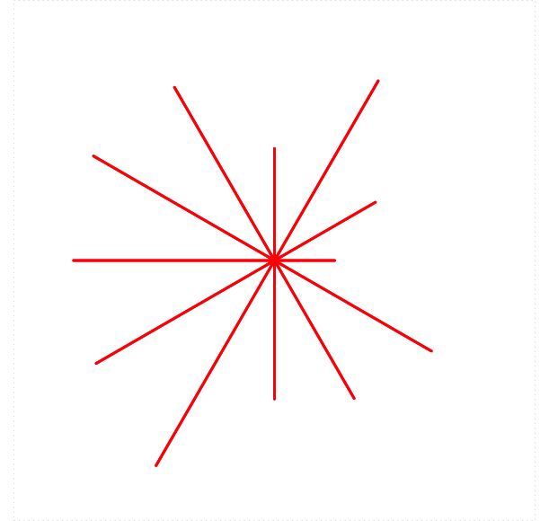

# Turtle Graphics {#turtle}

```{r xkcd-turtles, echo=F, fig.pos='!h', fig.cap="Turtles, by xkcd.", out.width="90%", fig.align="center"}
knitr::include_graphics("images/xkcd-turtles.png")
```

In this chapter we will practice our knowledge of R---and of basic programming concepts---in the context of a special R-package for graphics:  package **TurtleGraphics** [@R-TurtleGraphics].  Many of the examples from this Chapter are drawn from the Vignette for the package.^[Turtle Graphics itself is not original to R.  It was developed in the 1960's by Seymour Papert for use in the LOGO programming language.  LOGO is a general-purpose programming language but has been primarily used to teach programming concepts to children.  Nevertheless, grown-ups enjoy playing with Turtle Graphics so much that implementations of the system are now found in several major "professional-grade" programming languages.  For more information about Turtle Graphics, consult @Papert1993.]

\newpage

## Basic Movements

First, we begin by loading the package:

```{r eval = F}
library(TurtleGraphics)
```

```{r include=FALSE}
library(TurtleGraphics)
```

In order to create a Turtle Graphics scenario, call the function `turtle_init()`.  You get the plot shown in Figure \@ref(fig:initial-turtle).

```{r initial-turtle, cache = T, out.width = "50%", fig.align="center", fig.cap = "Initialized Turtle"}
turtle_init()
```

By default the turtle is positioned in the middle of a square of dimensions 100 units by 100 units.  (These dimensions can be changed, as we will see later on.)

You can get the turtle's position at any time:

```{r eval = F}
turtle_getpos()
```

```
##  x  y 
## 50 50 
```

The turtle also begins facing North.  This is considered to be angle 0, as you can tell by asking for the current angle of the turtle:

```{r eval=FALSE}
turtle_getangle()
```

```
## angle 
##     0 
```


Now let's make the turtle move.  If you are following along on your own computer, it's best to run the lines of code one at a time, so you can see the effect of each command.  (If you run multiples lines, you'll only see the graph produced by the final line.)


```{r first-movement, cache = T, out.width = "50%", fig.keep = 'last', echo = 2:3, fig.cap = "First Movements", fig.align="center"}
turtle_init()
turtle_forward(dist = 30)
turtle_backward(dist = 10)
```

The result appears in Figure \@ref(fig:first-movement). Next we'll add a little triangle:

```{r add-triangle, cache = T, out.width = "50%", fig.keep = 'last', echo = 4:11, fig.cap = "Adding a Triangle", fig.align="center"}
turtle_init()
turtle_forward(dist = 30)
turtle_backward(dist = 10)
turtle_right(90)
turtle_forward(10)
turtle_left(angle = 135)
turtle_forward(14.14)
turtle_left(angle = 90)
turtle_forward(14.14)
turtle_left(angle = 135)
turtle_forward(10)
```

You can see the triangle in Figure \@ref(fig:add-triangle).

The turtle is set in the "down" position, so that it leaves a trace out the path that it follows.  You can avoid the trace by pulling the turtle "up" with `turtle_up()`.  Whenever you want to restore the tracing, call `turtle_down()`.  See Figure \@ref(fig:up-down) for the results of the following code.

```{r up-down, cache = T, out.width = "50%", fig.keep = 'last', echo = 12:19, fig.cap = "We moved the turtle around in the up position, then put the turtle down and traced out a line segment.", fig.align="center"}
turtle_init()
turtle_forward(dist = 30)
turtle_backward(dist = 10)
turtle_right(90)
turtle_forward(10)
turtle_left(angle = 135)
turtle_forward(14.14)
turtle_left(angle = 90)
turtle_forward(14.14)
turtle_left(angle = 135)
turtle_forward(10)
turtle_up()  # stop tracing
turtle_right(angle = 90)
turtle_forward(dist = 10)
turtle_right(angle = 90)
turtle_forward(dist = 17)
turtle_down()  # start tracing again
turtle_left(angle = 180)
turtle_forward(dist = 34)
```

You can change the color of the lines your turtle draws:

```{r eval = FALSE}
turtle_col(col = "green")
```

In R here are many, many colors to choose from, and 657 of them even have names.  To view them, use:= the `colors()` function:  \index{R-functions!colors()@\texttt{colors()}}

```{r eval = F}
colors()
```

You can also hide your turtle, and show it again any time you like.  See Figure \@ref(fig:hide-show) for the results of the following code.

```{r hide-show, cache = T, out.width = "50%", fig.keep = 'last', echo = 21:26, fig.cap = "The graph after hiding, moving and showing.", fig.align="center"}
turtle_init()
turtle_forward(dist = 30)
turtle_backward(dist = 10)
turtle_right(90)
turtle_forward(10)
turtle_left(angle = 135)
turtle_forward(14.14)
turtle_left(angle = 90)
turtle_forward(14.14)
turtle_left(angle = 135)
turtle_forward(10)
turtle_up()  # stop tracing
turtle_right(angle = 90)
turtle_forward(dist = 10)
turtle_right(angle = 90)
turtle_forward(dist = 17)
turtle_down()  # start tracing again
turtle_left(angle = 180)
turtle_forward(dist = 34)
turtle_col(col = "green")
turtle_hide()
turtle_left(angle = 150)
turtle_forward(dist = 20)
turtle_left(angle = 60)
turtle_forward(dist = 20)
turtle_show()
```

Finally, you can choose the type of line your turtle draws, and the width of the line.  See Figure \@ref(fig:type-width) for the results of the following code.

```{r type-width, cache = T, out.width = "50%", fig.keep = 'last', echo = 27:31, fig.cap = "Choosing line-type and line-width.", fig.align="center"}
turtle_init()
turtle_forward(dist = 30)
turtle_backward(dist = 10)
turtle_right(90)
turtle_forward(10)
turtle_left(angle = 135)
turtle_forward(14.14)
turtle_left(angle = 90)
turtle_forward(14.14)
turtle_left(angle = 135)
turtle_forward(10)
turtle_up()  # stop tracing
turtle_right(angle = 90)
turtle_forward(dist = 10)
turtle_right(angle = 90)
turtle_forward(dist = 17)
turtle_down()  # start tracing again
turtle_left(angle = 180)
turtle_forward(dist = 34)
turtle_col(col = "green")
turtle_hide()
turtle_left(angle = 150)
turtle_forward(dist = 20)
turtle_left(angle = 60)
turtle_forward(dist = 20)
turtle_show()
turtle_left(angle = 150)
turtle_lty(lty = 4)
turtle_forward(dist = 17)
turtle_lwd(lwd = 3)
turtle_forward(dist = 15)
```

**Note:**  you can learn more about `lty` and `lwd` with `help(par)`.


## Making Many Movements:  An Introduction to Looping

Eventually we want to make some complex figures that require many movements on the part of the turtle.  In order to make these go faster, we can turn off some of the turtle graphing by wrapping the desired movements in `turtle_do()`.  See Figure \@ref(fig:turtle-do-intro) for the results of the following code.


```{r turtle-do-intro, cache = T, out.width = "50%", fig.keep='last', fig.cap="After final movement.", fig.align="center"}
turtle_init()
turtle_do({
  turtle_move(10)
  turtle_turn(45)
  turtle_move(15)
})
```

(`turtle_turn()` turns to the left by default.)  Of course, for such a small number of movements using `turtle_do()` does not matter much, but we will practice using it for a bit.

How might we make a square?  The following code offers one way to do it.  See Figure \@ref(fig:turtle-square) for the results.

```{r turtle-square, cache = T, out.width = "50%", fig.keep='last', fig.cap="Making a square.", fig.align="center"}
turtle_init()
turtle_do({
  turtle_move(20)
  turtle_right(90)
  turtle_move(20)
  turtle_right(90)
  turtle_move(20)
  turtle_right(90)
  turtle_move(20)
  turtle_right(90)
})
```

This is a bit repetitious.  Surely we can take advantage of the fact that there is a clear pattern to the turtle's movements.  A `for`-loop seems called for, as in the following code to build the square:

```{r eval=FALSE}
turtle_init()
turtle_do({
  for(i in 1:4) {
    turtle_forward(dist = 20)
    turtle_right(angle = 90)
  }
})
```


As we learned in Chapter \@ref(flow), the more you need to repeat a particular pattern, the more it makes sense to write your code with a loop.  Suppose, for example, that you decide to make regular octagons.  A regular octagon has eight sides, and you turn 45 degrees after drawing each side.  You can do this easily by modifying the square-code as follows (see Figure \@ref(fig:turtle-octagon) for the results):

```{r turtle-octagon, cache = T, out.width = "50%", fig.keep='last', fig.cap="Making an octagon.", fig.align="center"}
turtle_init()
turtle_do({
  for(i in 1:8) {
    turtle_forward(dist = 20)
    turtle_right(angle = 45)
  }
})
```


You can even make many small turns, so that the resulting figure starts to look like a circle (see Figure \@ref(fig:turtle-circle) for the results):


```{r turtle-circle, cache = T, out.width = "50%", fig.keep='last', fig.cap="Making a circle.", fig.align="center"}
turtle_init()
turtle_setpos(x = 30, y = 50)
turtle_do({
  for(i in 1:180) {
    turtle_forward(dist = 1)
    turtle_right(angle = 2)
  }
})
```

Notice that in the above code the turtle was initially set a bit to the left of center, so that the resulting circle would be situated close to middle of the region.


If you allow the index variable to be involved in the computations in the body of the loop then you can start making more complex figures.  For example, here is the code for a spiral (see Figure \@ref(fig:turtle-spiral) for the results):

```{r turtle-spiral, cache = T, out.width = "50%", fig.keep='last', fig.cap="Using a loop to make a spiral.", fig.align="center"}
turtle_init(width = 150, height = 150, mode = "clip")
turtle_do({
  turtle_right(90)
  for (i in 1:720) {
    turtle_left(1)
    turtle_forward(i/720)
  }
})
```

The turtle turns one degree every time R goes through the loop, but the amount it travels forward ($i/720$) increases as the index variable `i` increases.^[Another thing to notice is that we set the width and height of the region ourselves, so that the spiral would fit into it.  We also set `mode` to `clip` rather then leaving it at its default value of `error`.  With `mode = "clip"`, R won't throw an error message at you when the turtle moves outside of its region.  Clip-mode is very handy when you are developing a graph and don't know in advance precisely where the turtle will go.]


## Writing Turtle Functions

Once you have designed some shapes that you think you might want to draw again, you should write them up as functions.  Here for example, is the code for a function that makes squares:

```{r}
turtle_square <- function(side) { 
  for (i in 1:4) {
    turtle_forward(side)
    turtle_right(90) 
  }
}
```

Note that the user can vary the length of a side.

Functions are nice, but note that `turtle_do()` cannot be used freely inside of them.  For example, suppose you were to write the square-making function as follows:

```{r eval = F}
turtle_square <- function(side) { 
  turtle_do({
    for (i in 1:4) {
      turtle_forward(side)
      turtle_right(90)
    }
  })
}
```

Attempting to use the function would result in an error:

```{r eval=F}
turtle_init()
turtle_square(50)
```

```
 Error in stopifnot(is.numeric(distance), 
   length(distance) == 1, is.finite(distance)) : 
  object 'side' not found 
```

`turtle_do()` cannot find the side-length argument that was passed into the function.  Although `turtle_do()` can appear inside of functions, it has to work on literal values, not on variables.

## Random Moves

So far our turtle has moved in very regular and disciplined ways.  It's time to break the pattern, a bit. R has a quite a few functions to generate numbers that look "random"; we will use some of these functions to make the turtle move about randomly.

### Sampling from a Vector

You have already met the `sample()` \index{R-functions!sample()@\texttt{sample()}}function (see Section \@ref(if-statements)).  Let's take a closer look at it.

`sample()` makes a random choice from a given vector.  From the R-help we read that the general form of a call to sample is as follows:

```{r eval = F}
sample(x, size, replace = FALSE, prob = NULL)
```

In the above call:

* `x` is the vector from which we wish to sample (R refers to it as the "population");
* `size` is the number of random samples we want;
* `replace` says whether or not to replace each member of the population after we have sampled it.
* `prob` specifies the desired probability for each member of the population to be chosen.

A few examples will help us understand how the arguments work:

```{r echo = 2:3}
set.seed(2020)
vec <- 1:10 # we'll sample from this vector
sample(vec, 1)
```

We got only one number because we set `size` to 1.  Every element in `vec` had an equal chance of being the element selected.  This time we got 7, but if you were to run the function again for yourself your results would probably be different.

Let's sample 10 numbers from `vec`:

```{r echo = 2:2}
set.seed(3030)
sample(vec, 10)
```

Because `replace` was left at its default value of `FALSE`, R did not replace numbers after pulling them from the `vec`.  After each sample, the remaining numbers all had the same chance to be picked next.  Setting `size` to the length of `x` and keeping `replace = FALSE` therefore has the effect of randomly shuffling the elements of `x`.

Of course when `replace = FALSE` any attempt to sample more than the number of elements of `vec` will result in an error:

```{r eval = F}
sample(vec, 11)
```

```
Error in sample.int(length(x), size, replace, prob) : 
cannot take a sample larger than the 
population when 'replace = FALSE'
```

When we set `replace = TRUE` then each selected element is returned to the population.  At any stage, the chance for a given member of the population to be the one selected next is the same---no matter how many times that member has already been selected.  Thus, when `replace = TRUE` you are liable to see repeats:

```{r echo = 2:2}
set.seed(4040)
sample(vec, 20, replace = TRUE)
```

When the `prob` parameter is left at its `NULL` value, R gives each member of the population the *same* chance to be the member that is selected.  It is possible to adjust the probabilities of selection by setting `prob` to a vector of probabilities (one for each corresponding member of `x`).  Thus, suppose we want to select 20 numbers from `vec`, according to the following the probabilities:

* 5% chance of selection, for each number from 1 to 8;
* 30% chance for 9 to be selected;
* 30% chance for 10 to be selected.

Then we can call `sample()` like this:

```{r echo = 2:2}
set.seed(5050)
sample(vec, 20, replace = TRUE,
       prob  = c(rep(0.05, 8), 0.30, 0.30))
```

Notice that we a majority of 9's and 10's:  this was fairly likely to occur since each selection had a 60% chance of turning out to be 9 or 10.

### Application: a Bouncing Turtle

Let's apply `sample()` to design a scenario in which the turtle moves a fixed amount at each step, but the direction---north, east, south, or west---is completely random.  When the turtle reaches the boundary of its domain, however, we would like it to "bounce back":  i.e., take a step in the direction opposite to the step that brought it to the boundary.  We will also query the user prior to each step, asking if he/she wants to see another move.  This not only allows the user to decide when to end the scenario; it also permits the user to see where the turtle is after each step.

One possible implementation is as follows:


```{r eval = F}
turtle_bounce <- function(side = 60, step= 10) {
  if ( (side/2) %% step != 0 ) {
    stop("Side-length divided by two must be a multiple of step.")
  }
  bounds <- c(0, side)
  turtle_init(side, side, mode = "clip")
  origin <- turtle_getpos()
  cp <- turtle_getpos()
  repeat {
    move <- readline(prompt = "Go Again? (enter q to quit):  ")
    if ( move == "q") break
    x <- cp["x"]
    y <- cp["y"]
    if (x %in% bounds | y %in% bounds) {
      angle <- 180
    } else {
      angle <- sample(c(0,90,180,270), 1)
    }
    turtle_right(angle)
    turtle_forward(step)
    cp <- round(turtle_getpos(), 0)
    print(cp)
  }
  cat("All done!")
}
```

Play the game a few times, to get a feel for how it works:

```{r eval = F}
turtle_bounce(60, 15)
```


Let's examine the code a bit more closely.

The definition indicates that there are two parameters:  `side` and `step`.

* The `side` parameter gives the dimensions of the Turtle's field.  Thus if `side` were set to 60---which is the default---then the field would be a 60-by-60 square, with the origin $(0,0)$ in at lower-left corner and the point $(60, 60)$ at the upper-right corner.  When the turtle is initialized it will appear in the middle of the square, at the point $(30, 30)$.
* `step` specifies how many units the turtle will move at each step. In this analysis we will assume that `step` is set to 15.

Inside the function, we begin with a bit of input-validation:

```{r eval = F}
if ( (side/2) %% step != 0 ) {
    stop("Side-length divided by two must be a multiple of step.")
  }
```

Remember that the turtle will start at $(\texttt{side}/2, \texttt{side}/2)$ and will move `step` each time.  If $\texttt{side}/2$ is not evenly divisible by `step` then the turtle would be able to go from inside its field to outside in a single step.  We don't want that to happen so we stop the user if the remainder after dividing $\texttt{side}/2$ by `side` is anything other than zero.

If the input is OK, then we set up a vector `bounds` that records the smallest and largest possible values for the $x$ and $y$ coordinates of the turtle:

```{r eval = F}
bounds <- c(0, side)
```

Next, we initialize the turtle in the middle of the field and record its initial position in the vector `cp`:


```{r eval = F}
turtle_init(side, side, mode = "clip")
origin <- turtle_getpos()
cp <- turtle_getpos()
```


(You can think of `cp` as short for:  "current position".)

Next, we enter a `repeat`-loop.  Inside the loop we begin with:

```{r eval = F}
move <- readline(prompt = "Go Again? (enter q to quit):  ")
if ( move == "q") break
x <- cp["x"]
y <- cp["y"]
```

We first asked the user if she wanted to quit.  If she enters "q" then we'll break out of the loop and end the scenario.  If she enters anything else (including just pressing Enter) then we record the $x$ and $y$ coordinates of the turtle's current position in the vectors `x` and `y` respectively.

Our next task is to determine how the turtle should move:

```{r eval = F}
if (x %in% bounds | y %in% bounds) {
      angle <- 180
    } else {
      angle <- sample(c(0,90,180,270), 1)
    }
```

If the turtle is at a boundary (either `x` equal to 0 or 60 or `y` equal to 0 or 60) then we need to "bounce back".  This corresponds to making the turtle turn right by 180 degrees and then step.  On the other hand if the turtle is not at a boundary then the direction of the turtle should be random, so we should have it turn right by either 0, 90, 180 or 270 degrees, with each possibility being equally likely.  This is accomplished with the above call to the `sample()` function.


Having determined the amount by which to turn prior to the next step, we then have the turtle turn that amount and take the step:

```{r eval = F}
turtle_right(angle)
turtle_forward(step)
```

Finally, we set `cp` to the new position of the turtle, and print that position out to the console for the user to see:

```{r eval = F}
cp <- round(turtle_getpos(), 0)
print(cp)
```

Note that we rounded off the position to the nearest while number.  This was done because the authors of the **TurtleGraphics** package use floating point arithmetic for their numerical operations, so sometimes the computed positions differ from whole numbers by a very tiny amount.

We then repeat the loop.

### Uniform Random Numbers

`sample()` picks an element from a finite population.  Sometimes, though, we want R to give the impression that it has picked a *real number* at random out of a range of real numbers.  This can be accomplished with the `runif()` function.\index{R-functions!runif()@\texttt{runif()}}

A call to `runif()` looks like this:

```{r eval = F}
runif(n, min = 0, max = 1)
```

The idea is that R will produce `n` real numbers that have the appearance of having been drawn randomly from the interval of real numbers whose lower and upper bounds are specified respectively by `min` and `max`.

Thus, to get 10 "random" numbers that all lie between 0 and 1, you can leave `min` and `max` at their defaults and ask for:

```{r echo = 2:2}
set.seed(2020)
runif(10)
```


### Pseudo-Randomness and Setting a Seed

It's important to point out that R doesn't generate truly random numbers.^[Indeed, philosophers of mathematics debate what randomness "really" is.]  After all, R simply runs a computer which operates according to a set of completely-specified steps.  Thus the random data generated by R and by other computer languages is often called *pseudorandom*.  \index{pseudo-random numbers}Although the functions for random-number generation have been carefully designed so as to follow many of the statistical laws we associate with randomness in nature, all of the pseudo-random output is determined by an initial value and a deterministic number-generating algorithm.

We actually have the ability to set the pseudorandom data ourselves.  This is called *setting the random seed*.  From any specified seed, the result of calls to R's random-data functions will be completely determined (although---just as in the case of "real" randomness---the output will still probably "look" random).

The `set.seed()` function\index{R-functions!set.seed()@\texttt{set.seed()}} will fix the random output.  Try running the following two lines of code more than once:

```{r}
set.seed(2025)
runif(10)
```

You will get the same output every time.  If you change the argument of `set.seed()` to some other integer the output will probably change---but it will stay the same when you run the code *again* from that that new seed.

### Application:  a Drunken Turtle {#drunken-turtle-intro}

We will now modify the previous scenario so that the turtle's motion will be almost completely random.  Even though it will take the same-size step every time, the angle at which it steps will be completely random:  any real number of degrees from 0 to 360.  We will also show the user the position of the turtle at each step, and use the "distance formula" from high-school geometry to compute and display the current distance of the turtle from the place where it started.

```{r}
turtle_drunk <- function(side, step) {
  turtle_init(side, side, mode = "clip")
  # save (side/2, side/2), the turtle's initial position:
  initial <- turtle_getpos()
  repeat {
    move <- readline(prompt = "Go Again? (enter q to quit):  ")
    if ( move == "q") break
    # pick a random angle to turn by:
    angle <- runif(1, min = 0, max = 360)
    turtle_left(angle)
    turtle_forward(step)
    # get new position, make it the current position:
    cp <- turtle_getpos()
    # print to console:
    print(cp)
    # determine distnce from initial position (round to 3 decimals):
    distance <- round(sqrt((cp[1] - initial[1])^2 + (cp[2] - initial[2])^2),3)
    # prepare message to console,and print it:
    message <- paste0("Distance from starting point is: ", distance)
    cat(message)
  }
  cat("All done!")
}
```

Try the game once or twice:

```{r eval = F}
turtle_drunk(100, 5)
```

It is natural to wonder how likely the turtle is to wander back close to where it started, and to wonder how often that will happen.  We will address questions like these in Chapter \@ref(simulation).

## More Complex Turtle Graphs

Simple instructions, when combined with looping, can produce quite complex patterns.  Consider the following process (with results shown in Figure \@ref(fig:turtle-zany)):

```{r turtle-zany, cache = T, out.width = "50%", fig.keep='last', fig.cap="Galactic Zany!", fig.align="center"}
turtle_init(1000, 1000, mode = "clip")
turtle_do({
  turtle_setpos(600,400)
  turtle_right(90)
  for (i in 1:2000) {
    turtle_right(i)
    turtle_forward(sqrt(i))
  }
})
```

You might enjoy figuring out why this pattern occurs.  As you ponder this, it might help to construct a set of "ragged" spirals with somewhat larger steps, and pause at each step.  Code like the following might be useful:^[Also don't forget that every 360 degrees is a full turn around the circle, so when the turtle's angle is, say 720 degrees, it's the same as an angle of 360 degrees which is the same as an angle of 0 degrees.  All three angles amount to the same direction.]

```{r eval = F}
turtle_init(1000, 1000, mode = "clip")
turtle_do({
  i <- 1
  turtle_right(90)
  repeat {
    bidding <- readline("Proceed? (Enter q to quit) ")
    if ( bidding == "q") break
    turtle_right(i)
    turtle_forward(2*sqrt(i))
    cat(paste0("Turned ", i, " degrees,\n"))
    cat(paste0("stepped forward ", round(2*sqrt(i), 3), " units.\n"))
    cat("Turtle's current angle is: ", turtle_getangle(), " degrees.\n")
    i <- i + 20
  }
  cat("All done!")
})
```

\newpage

## Glossary {-}

Pseudo-random Numbers \index{pseudo-random numbers}

:  A sequence of numbers generated by a computer procedure designed to make the sequence appear to follow statistical laws associated with random processes in nature.

\newpage

## Exercises {-}

```{r echo=F, fig.pos='!h', out.width="50%", fig.align="center"}
knitr::include_graphics("images/thinking.png")
```

1. Write a function called `turtle_gon()` that draws a regular polygon.  The user should be able to specify the side-length and the number of sides.  Start with `turtle_init()` and use your function to draw a regular dodecagon (twelve sides) with each side having a side length of 115 units. Your figure should not stray outside of the turtle's field, so you may have to adjust the position of your turtle a bit prior to calling your function.

1. Write a function called `turtle_star()` that can make stars like the ones in Figure \@ref(fig:turtlestarstart).  The user should be able to specify:
    * the number of rays in a star (default is 6);
    * the length of the rays (default is 20);
    * the color of the rays (default is red);
    * the line-type of the rays (default is 1);
    * the line-width of the rays (default is 1).

    ```{r turtlestarstart, echo = F, fig.cap="Sample Stars", out.width="60%", fig.align="center"}
    knitr::include_graphics("images/turtle-stars.png")
    ```
    

    Starting with `turtle_init()`, use your function to create a star with 10 rays each of length 20 units.  The lines should be red and dashed.  I'll leave the thickness   up to you.

1. Make a new star function `turtle_rstar()` in which the lengths of the rays are not determined by the user but instead vary randomly from 5 to 25 units, as in Figure \@ref(fig:next-turtle-star): 

    ```{r next-turtle-star, echo = F, fig.cap="A star with rays of random lengths.", out.width="60%", fig.align="center"}
    
    ```

    The defaults for the other parameters should be the same as in the previous exercise.  Starting from `turtle_init(50,50)` make a random star with 20 rays and a line-thickness of 3.  Other parameters should be left at their default-values.

1. Make a new star function `turtle_rstarColors()` that behaves like `turtle_rstar()` except that instead of being determined by the user the ray-color varies randomly from one ray to another, as in Figure \@ref(fig:turtle-star-3): 

    ```{r turtle-star-3, echo = F, fig.cap="A star with rays of random lengths and random colors.", out.width="60%", fig.align="center"}
    knitr::include_graphics("images/turtle-stars-3.png")
    ```

    Each ray should have a color drawn randomly from the vector of all colors given by `colors()`. Starting from `turtle_init(50,50)` make a random star with 20 rays and a line-thickness of 6.  Other parameters should be left at their default-values.


