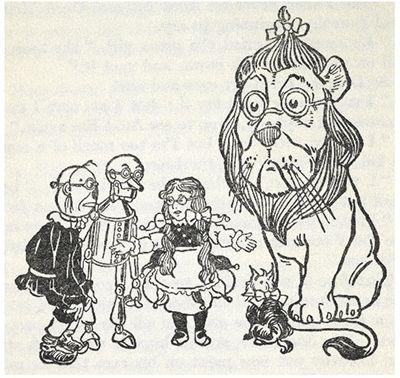

# Files {#files}

```{r wizard-oz, echo=FALSE, fig.pos='!h', fig.cap = "Scarecrow, Tin Man, Dorothy, Toto and the Cowardly Lion wearing Emerald City Specticals:  an original llustration from *The Wonderful Wizard of Oz*, by L. Frank Bloom.", out.width = "60%", fig.align = "center"}

```

```{r include = FALSE}
library(tidyverse)
library(stringr)
```


\newpage

Most computer programming tasks involve the processing or analysis of data, and unless we are doing a simulation, that data has not been created within the program that is supposed to process it.  This Chapter covers some basic techniques for importing data into R, saving it for future use, and exporting it for use by others.

## Downloading Files

First we'll deal with the situation in which the data we want is in a file somewhere on the Internet.  In this case we need only download the file to our computer.

It's a good idea to keep one's work organized.  Since we plan to begin downloading data files, we might as well create a directory dedicated to them.  It's easy to use the R Studio IDE to create the directory, but we might as well learn how the same task could be accomplished with an R-command.  We will use the function `dir.create()`. \index{R-functions!dir.create()@\texttt{dir.create()}}

```{r eval =FALSE}
dir.create("downloads")
```

We are ready to begin downloading.  Let's begin with a file^[This file is a compressed version of `words.txt` file used in *Think Python* [@Downey2015].] at the URL:

>https://homerhanumat.github.io/r-notes/downloads/words.zip

The relevant function is `download.file()`:

```{r eval =FALSE}
download.file(url = "https://github.com/homerhanumat/r-notes/blob/master/downloads/words.zip?raw=true", destfile = "downloads/words.zip")
```

The file should now be in the `downloads` folder of your Home directory.

We see that it's a zip-file.  R can unzip it for us:


```{r eval =FALSE}
unzip(zipfile = "downloads/words.zip")
```

We now have the text-file `words.txt` in our `downloads` directory.  In R Studio you can examine the contents of the file if you click on the file-name in your **Files** tab.  You see something like this:

```
aa
aah
aahed
aahing
aahs
aal
...
```

The file is a fairly comprehensive list of words in the English language---all in lowercase, one word per line.

## Reading Text Files with `readLines()`

Let's transfer the contents of `words.txt` to a character vector in R.  The function for this is `readLines()`: \index{R-functions!readLines()@\texttt{readLines()}}

```{r}
words <- readLines(con = "downloads/words.txt")
```

`readLines()` is similar to `readline()`, which we have used in the past to get a single line of input from the user.  `readLines()` can also read from the console---this is called *standard input*---but it can also make a *connection*^[A *connection*, also known to R-programmers as a "generalized file", is any one of a wide range of interfaces that can be established with the world outside of the R-session for the purpose of sending or receiving data.  One can make a connection with files stored locally on one's computer, with URL addresses on the internet, with databases, and so on.] with any file.  In the code above, we set the connection to be the file `words.txt`.  By default `readLines()` reads the file---one line at a time as a string.  The resulting character vector is named `words`.^[Note that the **stringr** package contains a vector named `words` that is used for practicing with regular expressions.  This vector is now masked by the `words` vector you have created, but you can still access it as `stringr::words`.]

Let's look at words to see if it came out the way we expected.  The `head()` function \index{R-functions!head()@\texttt{head()}} works not only on data frames but also on vectors:

```{r}
head(words)
```

Yes, it looks like we got one word into each element of the vector.  The total number of words is:

```{r}
length(words)
```


## Reading Text Files with **readr**

`words.txt` was unusually simple---just one piece of data per line.  It made sense to read it into a vector.  Most of the files that we encounter have a more complex structure.  In many cases it is best to incorporate them into R as data frames.

R has several tools for reading data into data frames. One of the most convenient---and most popular---is the set of functions in the **readr** package [@R-readr].  It's attached automatically when you load the tidy-verse, but you can also attach it separately:

```{r eval =FALSE}
library(readr)
```

Let's practice reading in a file from the Internet.  The URL is:

>https://query.data.world/s/b6plbxp3ym20s5a5iey36geul

The file is taken from [data.world](https://data.world/jonloyens/alcohol-and-life-expectancy), a site very much worth exploring, and it addresses part of a study on alcohol consumption and life-expectancy in the nations of the world.  (The file-extension `.csv` indicates that the it is expected to use commas to separate data values.)

The easiest way to learn the functions of **readr** is to use a widget supplied by the R Studio IDE:

* In the **Environment** Pane, find the drop-down menu **Import Dataset**,
* Ask to **Import CSV ...**.
* You will be taken to a dialog box.  Enter the above URL in the **File/URL** field and press the **Update** button.
* A preview of the data is shown.
* At the bottom left there are a number of Import Options.  The most important one at this point is the Name.  Instead of the messy name that is shown, type something descriptive. (We'll choose `alcGDP`.)
* Note the Code Preview box at the bottom right.  It contains the R-commands needed to download and read the text-file `alcGDP` into R as a data frame.
* You should copy the code and save it somewhere (in an R script or R Markdown document) in order to keep a record of your work.
* You may then press the **Import** button.

```{r include =FALSE}
alcGDP <- read_csv("~/git/r-notes/downloads/alcGDP.csv")
save(alcGDP, file = "downloads/alcGDP.rda")
```

The data is read into `alcGDP` according to the `read_csv()` call below:

```{r eval =FALSE}
alcGDP <- read_csv("https://query.data.world/s/b6plbxp3ym20s5a5iey36geul")
```

```{r include =FALSE}
load("downloads/alcGDP.rda")
```

If you pressed the **Import** button, then you can see `alcGDP` in the Editor window.  Notice that is has five variables.  Two of them have only `NA` values, and the final two of them have names that are simply too long to be practical.  Go ahead and fix this:

```{r}
names(alcGDP)[c(4,5)] <- c("liters", "gdp")
alcGDP$YearDisplay <- NULL
alcGDP$SexDisplay <- NULL
```

Now take a look at the frame:

```{r}
head(alcGDP)
```

`liters` gives the mean total liters of alcohol consumed per person in each country, and `GDP` is the country's Gross Domestic Product in millions of dollars.

From the Console output you can tell that `alcGDP` is a tibble rather than a data frame.  (The default behavior for `read_csv()` is to import data as tibbles.)

We won't analyze `alcGDP` here, but you might want to look at it later.  You can save it permanently to your Home directory with the `save()` function:

\index{R-functions!save()@\texttt{save()}}

```{r eval =FALSE}
save(alcGDP, file = "downloads/alcGDP.rda")
```

`alcGDP` is still in your Global Environment.  If you clear the environment later on, you can reload `alcGDP` as follows:

\index{R-functions!load()@\texttt{load()}}

```{r eval =FALSE}
load("downloads/alcGDP.rda")
```


## Writing to Files

If you would like to send the data in a data frame to a colleague who does not use R, then you should convert it to a common text-file format such as CSV.  For this purpose **readr** provides the `write_csv()` command.  The following code writes `m11survey` to a CSV file in your Home directory.

\index{R-functions!write.csv()@\texttt{write.csv()}}

```{r eval =FALSE}
write_csv(bcscr::m111survey, path = "m111survey.csv")
```

You may now transmit the file to your colleague.


## Application:  Making a Lexicon

A *lexicon* is any list of words---usually the words of a language or of some body of texts produced in that language.  In this Section we'll combine our file-handling skills with regular expressions to create a lexicon for L. Frank Bloom's classic *The Wizard of Oz*.

First you need to get hold of the text itself.  *The Wizrd of Oz* has been in the public domain for many years now, and is available from the [Gutenberg Project](https://www.gutenberg.org/).  You could look it up there and find the URL for download:

>[http://www.gutenberg.org/cache/epub/55/pg55.txt](http://www.gutenberg.org/cache/epub/55/pg55.txt)

Go ahead and download the file: \index{R-functions!download.file()@\texttt{download.file()}}

```{r eval =FALSE}
ozURL <- "http://www.gutenberg.org/cache/epub/55/pg55.txt"
if ( !(file.exists("downloads/oz.txt")) ) {
  download.file(url = ozURL,
                destfile = "downloads/oz.txt")
}
```

Next, read in the file, line by line: \index{R-functions!readLines()@\texttt{readLines()}}

```{r}
oz <- readLines(con = "downloads/oz.txt")
```

Take some time to look through `oz.txt`.  If we plan to make a lexicon for the book, then we probably don't want to include Gutenberg's header material or their discussion of licensing at the end.  We'll need to cut this material out of `oz`:

\index{R-functions!which()@\texttt{which()}}
```{r}
# a helper function
findIndex <- function(pattern, text) {
  str_detect(text, pattern = pattern) %>% which()
}

# now find lines to start and end at:
firstLine <- findIndex("^\\*\\*\\* START OF THIS PROJECT GUTENBERG", oz) + 1
lastLine <- findIndex("^End of Project Gutenberg's", oz)  - 1

# trim oz to the desired text:
oz2 <- oz[firstLine:lastLine]
```

Let us now take a first pass at splitting the text into all of its "words." Our first thought is that words are the parts of the text that are separated by one or more white-space characters, so we might try this:

\index{R-functions!unlist()@\texttt{unlist()}}
\index{R-functions!str\_split()@\texttt{str\_split()}}
```{r}
ozwds <- 
  oz2 %>% 
  str_split(pattern = "\\s+") %>% 
  unlist()
```

Next, let's convert all of the words to lowercase, then make a new word-list with no repeats, then sort that list:

\index{R-functions!str\_to\_lower()@\texttt{str\_to\_lower()}}
\index{R-functions!str\_sort()@\texttt{str\_sort()}}
\index{R-functions!unique()@\texttt{unique()}}
```{r}
ozWords <- 
  ozwds %>% 
  str_to_lower() %>% 
  unique() %>% 
  str_sort()
```

It's time now to examine our prospective lexicon.  Look around a bit in `ozWords`.  

* There are some numbers.  We'll get rid of them.
* There are an awful lot of strings that begin or end with punctuation.  This should not be difficult to remove with `str_replace()`.
* There are plenty of contractions, like `"aren't"`.  It seems reasonable to count these as words, so we'll leave them alone.
* There are hyphenated words.  What should we do with them?  In a book for grown-ups you'll find lots of hyphenated words where the components words are meaningful in themselves.  That's because of a grown-up grammar rule that says we should "hyphenate two or more words when they come before a noun they modify and act as a single idea."  This is important:  after all,"short-listed candidates" refers to candidates who appear on our short list, whereas "short listed candidates" appears to refer to short candidates who appear on our list.  If this were a grown-up text then I'd want to split on hyphens in order to capture the meaningful word-components.  In *The Wizard of Oz*, though, it seems that hyphenation is used mainly to create interesting new words out nonsense sound-fragments, as in:

    > So the Wicked Witch took the Golden Cap from her cupboard and placed it
upon her head.  Then she stood upon her left foot and said slowly:

    > "Ep-pe, pep-pe, kak-ke!"

    > Next she stood upon her right foot and said:

    > "Hil-lo, hol-lo, hel-lo!"

    > After this she stood upon both feet and cried in a loud voice:

    > "Ziz-zy, zuz-zy, zik!"
 
    It would seem that (for example) "zuz-zy" should count as a word, but its parts "zuz" and "zy" should not count as words.
    
* On the other hand, we often find *pairs* of hyphens that appear to act as the *emdash* character (&mdash;):

    >The cyclone had set the house down very gently\-\-for a cyclone\-\-in the
midst of a country of marvelous beauty.

    This causes such strings as "gently\-\-for" and "cyclone\-\-in" to appear in our lexicon.  We don't want that, so we need to split on double-hyphens.
    

Let's go back and try the splitting again:
\index{R-functions!strsplit()@\texttt{strsplit()}}

```{r}
ozwds <-
  oz2 %>% 
  str_split(pattern = "(?x)    # allow comments
                      (-{2,})  # two or more hyphens
                      |        # or
                      (\\s+)   # whitespace
                      ") %>% 
  unlist()
```

Now let's strip off any leading or trailing punctuation.  In ICU Unicode, `\p{P}` is a shortcut for any punctuation character:

\index{R-functions!str\_replace()@\texttt{str\_replace()}}

```{r}
ozWords <-
  ozwds %>% 
  str_replace(pattern = "^\\p{P}+",
              replacement = "") %>%   # strip leading punctuation
  str_replace(pattern = "\\p{P}+$",
              replacement = "") %>%   # strip trailing punctuation
  str_to_lower() %>% 
  unique() %>% 
  str_sort()
```


Taking a second look at `ozWords`, we see that we need to get rid of some numbers and a spurious empty string:

\index{R-functions!grepl()@\texttt{grepl()}}

```{r}
isNumber <- str_detect(ozWords, pattern = "^\\d+")
isEmpty <- ozWords == ""
validWord <- !isNumber & !isEmpty
ozWords <- ozWords[validWord]
```

A final check of `ozWords` appears not turn up any serious problems.  We'll take it as our lexicon for *The Wizard of Oz*.

For fun, let's make an index to the book.  First, a little helper function:

\index{R-functions!which()@\texttt{which()}}
```{r}
indexFactory <- function(lexicon, fn) {
  index <- list()
  fileLines <- readLines(con = fn)
  for ( i in seq_len(length(lexicon)) ) {
    word <- lexicon[i]
    pattern <- paste0("(?i)", word)
    hasWord <- str_detect(fileLines, pattern = pattern)
    index[[word]] <- which(hasWord)
  }
  index
}
```

Now we call our helper function to create the index:

```{r cache =TRUE}
ozIndex <- indexFactory(ozWords, "downloads/oz.txt")
```

We can use the index to look up words in the original text, without having to use regular expressions explicitly.  First we make a convenience-function for looking up words::

```{r}
ozLookup <- function(word) {
  
  fn <- "downloads/oz.txt"
  lexicon <- ozWords
  index <- ozIndex
  
  file <- readLines(con = fn)
  if ( !(word %in% lexicon ) ) {
    message <- paste0("\"", word, "\" is not in the lexicon!\n")
    return(cat(message))
  }
  matchLines <- index[[word]]
  number <- length(matchLines)
  cat("There are ", number, "lines that contain your request.\n\n")
  hrule <- rep("-", times = 30)
  for ( i in 1:number ) {
    lineNum <- matchLines[i]
    cat(hrule, "\n")
    cat(lineNum, ":  ", file[lineNum], "\n")
  }
}
```

Now we give it a try:

```{r}
ozLookup("lolliop")
```


And another try:

```{r}
ozLookup("humbug")
```

\newpage

## Glossary {-}

Connection (also called a "Generalized File") \index{connection}

:  An interface with the world outside of the R-session, for the purpose of sending or receiving data.


\newpage


## Exercises {-}

```{r echo=FALSE, fig.pos='!h', out.width="50%", fig.align="center"}
knitr::include_graphics("images/thinking.png")
```

1. The word "caracara" is in `words`.  Note that it in this word a sequence of four letters is immediately repeated.  Write a function that uses a regular expression to find all of the words in `words` that contain a doublet like this:  specifically, a sequence of *four or more* letters that are immediately repeated. (The repeated sequence need NOT make up the entire word, as in the case of "caracara.")  The program should `cat()` the words to the console, one per line.

1.  Write a program that uses a regular expression to find all of the words in `words` that contain a "q" that is not immediately followed by a "u".  The program should `cat()` the words to the console, one per line.

1.  Write a program that uses a regular expression to find all of the words in `words` that are 4-letter or 5-letter palindromes.  The program should `cat()` the words to the console, one per line.  (**Hint:**  consult Section \@ref(regex-captures).)

1.  It can be proven mathematically that there is no regular expression, no matter how complex, that matches all and only the palindromes.  We can write regular expressions to match all and only the palindromes that are less than some fixed number of characters, but we can't match palindromes of arbitrary length.  Write a program to find all of the palindromes in `words`.  Obviously this program won't have to use a regular expression!

1.  (\*) Gutenburg's version of Jane Austin's classic novel *Pride and Prejudice* may be downloaded from the URL:

    >https://www.gutenberg.org/files/1342/1342-0.txt
    
    Your mission is to create a lexicon for Austin's novel.  Follow the pattern of the work done in the text to make a lexicon for *The Wizard of Oz*.  You will have to make different choices, though, about what constitutes a "word".  For example, Austin's prose is complex and "grown-up"in comparison to the prose of *Oz*, so the parts of hyphenated words probably constitute valid words in and of themselves. Austin has a habit of concealing certain place-names with dashes, and occasionally in letters to each other Austin's characters will refer to a person by an initial.  Should initials and sequences of dashes count as words? And what about "12th" as in "the 12th of December"?  As you examine the text and your initial word list you will have to make decisions about these and other matters.
    
    Write a report in R Markdown in which you create the lexicon.  Include the code for all of your work---beginning from the file-download---so that a person who runs all of the code in the document will create the very same lexicon you made.  As you develop the lexicon, explain your code and the rationale for your choices about what counts as a "word" in Austin's novel.
    
    Conclude the report with a data frame of the twenty most common words in Austin's novel that are more than eight letters long.  The frame should have two variables:  one for the words and another for the number of occurrences.  The frame should be sorted so that the words appear in decreasing order of frequency (i.e., most common word comes first). 

1. (\*) Install the **tidytext** and **gutenbergr** packages.  **gutenbergr** simplifies the task of downloading a Project Gutenberg text, stripping off the spurious leading and trailing material.  **tidytext** automates a number of basic text-analysis tasks.  Read the Vignette in the **gutenberg** packages and learn how to find the words in a text. Find the unique words in *The Wizard of Oz* as determined by **tidytext**, and use the `setdiff()` function to compare the `ozWords` in this Chapter with the word-list according to **tidytext**.  What are the primary differences?

```{r echo=FALSE, eval=FALSE}
library(gutenbergr)
library(tidytext)
gutenberg_works(str_detect(title, "Wizard of Oz"))
ozBook <- gutenberg_download(55)
```

```{r echo=FALSE, eval=FALSE}
ozWordsG <-
  ozBook %>% 
  unnest_tokens(word, text) %>%
  .$word %>% 
  unique() %>% 
  sort()
```

```{r echo=FALSE, eval=FALSE}
setdiff(ozWordsG, ozWords)
setdiff(ozWords, ozWordsG)
```


